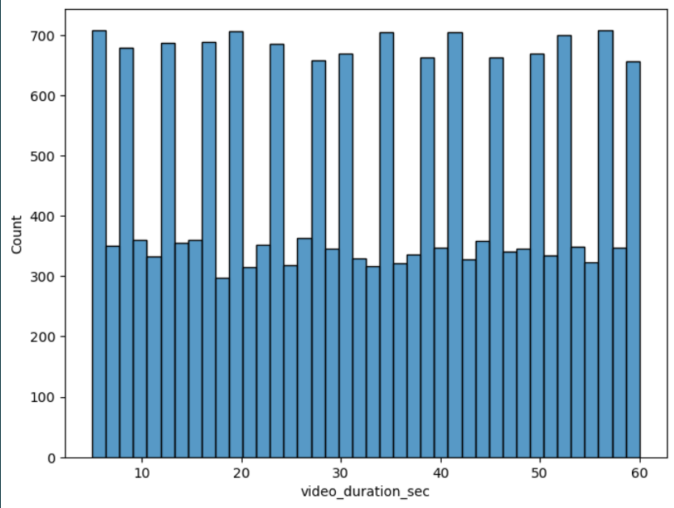
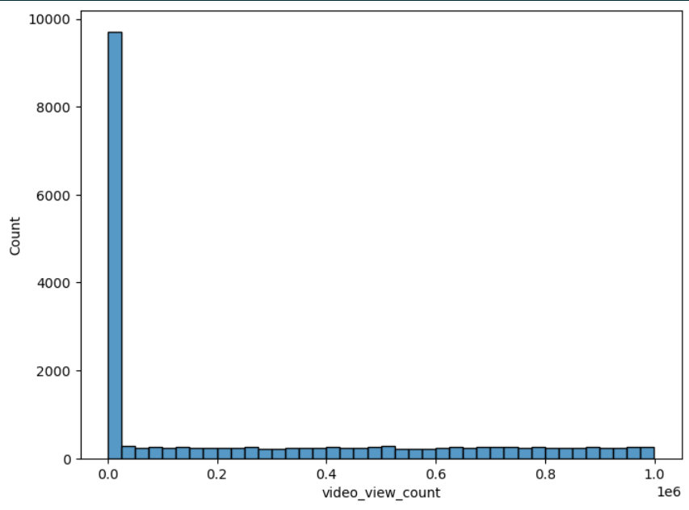
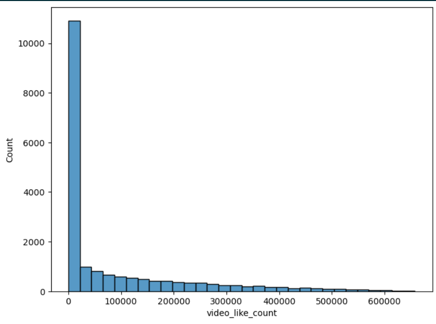

# TikTok Data Analysis

### Project Overview

This project involves performing Exploratory Data Analysis (EDA) on a TikTok dataset. The goal is to understand the structure and trends of the data, identify potential outliers, and explore the relationships between various features like video views, likes, shares, and user statuses.

### Data

The dataset contains information about TikTok videos, including:

* `claim_status`: Indicates whether a video contains a "claim" or an "opinion".
* `video_id`: A unique identifier for each video.
* `video_duration_sec`: Duration of each video in seconds.
* `video_transcription_text`: Transcribed text of the video content.
* `verified_status`: Shows whether the video's author is verified or not.
* `author_ban_status`: Indicates the ban status of the author (e.g., "active", "under review", "banned").
* `video_view_count`, `video_like_count`, `video_share_count`, `video_download_count`, `video_comment_count`: Various engagement metrics of the videos.

## Steps of Analysis

### 1. Data Loading and Inspection

* Loaded the dataset and displayed the first few rows to understand the structure.
* Checked the dimensions (`df.shape`), data types (`df.info()`), and summary statistics (`df.describe()`).
* Identified missing values in the dataset using `df.isna().sum()`.

### 2. Data Cleaning

* Removed rows containing missing values using `df.dropna()` to ensure a clean dataset for analysis.

### 3. Univariate Analysis

* Visualized the distributions of key numerical features using histograms and box plots:

  * `video_duration_sec`: Explored the distribution of video durations.
  * `video_view_count`: Analyzed the distribution of view counts and identified extreme values.
  * `video_like_count`: Checked the distribution of like counts.
  * `video_download_count`: Looked at the distribution of download counts.

   

### 4. Bivariate Analysis

* Compared `claim_status` with other features to identify patterns:
  * **Claims by Verification Status** : Histogram showing the distribution of claims by `verified_status`.
  * **Claim Status by Author Ban Status** : Compared `claim_status` with `author_ban_status` using a histogram to observe how different claim types correlate with ban status.
  * **Median Video Views by Ban Status** : Bar plot illustrating the median view counts based on the author's ban status.

### 5. Group Analysis

* Grouped the data to calculate the median `video_view_count` for each `claim_status` to understand which type of claim tends to attract more views.
* Visualized the total views by `claim_status` using a pie chart to show the proportion of views between "claim" and "opinion".

### 6. Outlier Detection

* Detected outliers in engagement-related features like `video_view_count`, `video_like_count`, `video_share_count`, etc., using the Interquartile Range (IQR) method.
* Calculated the number of values exceeding the outlier threshold for each metric.

### 7. Scatter Plot Analysis

* Created scatter plots to explore the relationships between `video_view_count` and `video_like_count`, distinguishing between "claim" and "opinion" videos.
* Plotted a specific scatter plot for videos labeled as "opinion" to analyze their like-view trends.

## Results

* **Video Duration** : Most videos are relatively short, with a few outliers indicating longer videos.
* **View Distribution** : There is a significant variation in the number of views, with some videos receiving exceptionally high views.
* **Claim Types** : Videos labeled as "claims" tend to have significantly higher median view counts compared to "opinions".
* **Verification and Ban Status** : Verified authors and those with "active" ban status appear to correlate with higher view counts.
* **Outliers** : Identified a considerable number of outliers in engagement metrics, indicating videos that performed exceptionally well.

## Conclusion

This EDA provides valuable insights into how different features of TikTok videos interact with each other. Understanding these dynamics can help in predicting video performance, understanding user behavior, and improving content strategies.
